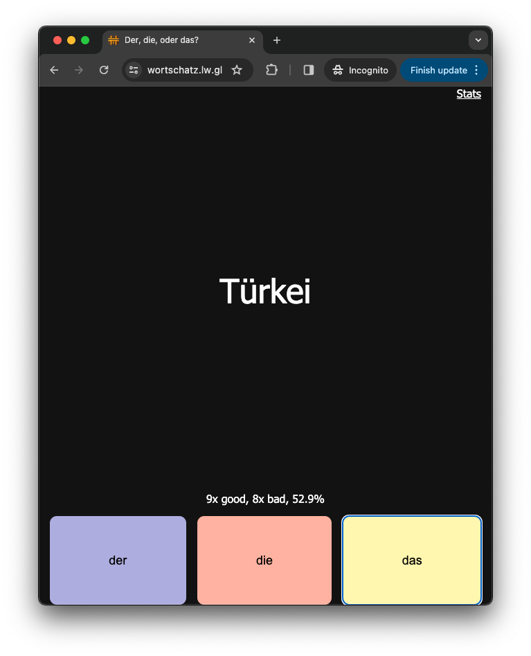

# Wordjet

Learn German articles.



There are many apps that try to help you learn German der/die/das. However, there is a slight delay
after each card is answer, slowing down the learning. Wordjet automatically switches to the next
word if you get correct, or displays an error and let it try again.

Wordjet tracks how often you succeeded on a word and suggests you a best word to try next. It's an
optimized version of [Anki](https://apps.ankiweb.net/).

## How to run it


```shell
pipenv install
pipenv run ./server.sh
```

## Dictionary

The words in the dictionary were semi-automatically extracted from [Goethe A1, A2, and B1 word
lists](https://www.goethe.de/en/spr/kup/prf/prf.html).
